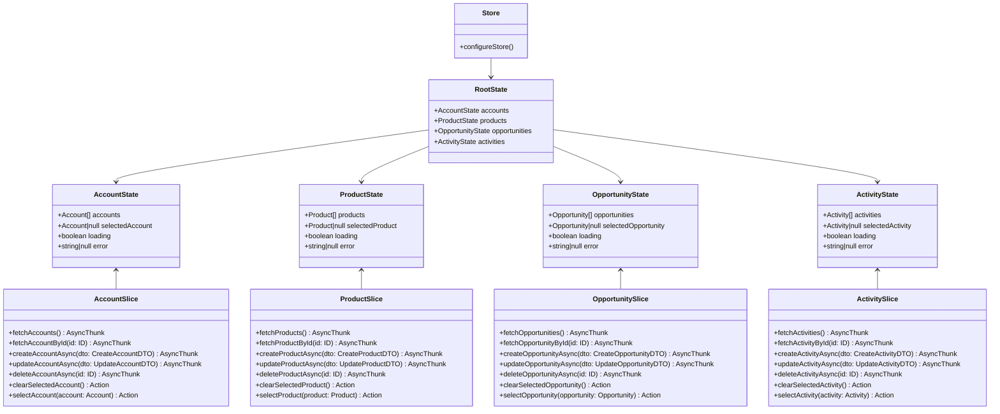

# CRMシステム クラス図

## ドメインモデル クラス図

以下のクラス図は、CRMシステムのドメインモデルの関係を示しています。


## リポジトリ クラス図

以下のクラス図は、リポジトリのインターフェースと実装の関係を示しています。


## Redux状態管理 クラス図

以下のクラス図は、Reduxを使用した状態管理の構造を示しています。



## コンポーネント構造 クラス図

以下のクラス図は、Reactコンポーネントの構造を示しています。

```mermaid
classDiagram
    class App {
        +render() JSX
    }
    
    class LocalStorageSyncComponent {
        +useLocalStorageSync()
        +render() null
    }
    
    class Navbar {
        +render() JSX
    }
    
    class HomePage {
        +render() JSX
    }
    
    class AccountsPage {
        -Account[] accounts
        -boolean loading
        -string|null error
        -boolean isCreating
        -boolean isEditing
        -Account|null selectedAccount
        -CreateAccountDTO formData
        +useEffect() void
        +handleInputChange() void
        +handleShowCreateForm() void
        +handleShowEditForm() void
        +handleCancelForm() void
        +handleCreateAccount() void
        +handleUpdateAccount() void
        +handleDeleteAccount() void
        +render() JSX
    }
    
    class ProductsPage {
        -Product[] products
        -boolean loading
        -string|null error
        -boolean isCreating
        -boolean isEditing
        -Product|null selectedProduct
        -CreateProductDTO formData
        +useEffect() void
        +handleInputChange() void
        +handleShowCreateForm() void
        +handleShowEditForm() void
        +handleCancelForm() void
        +handleCreateProduct() void
        +handleUpdateProduct() void
        +handleDeleteProduct() void
        +render() JSX
    }
    
    class OpportunitiesPage {
        -Opportunity[] opportunities
        -boolean loading
        -string|null error
        -boolean isCreating
        -boolean isEditing
        -Opportunity|null selectedOpportunity
        -CreateOpportunityDTO formData
        +useEffect() void
        +handleInputChange() void
        +handleShowCreateForm() void
        +handleShowEditForm() void
        +handleCancelForm() void
        +handleCreateOpportunity() void
        +handleUpdateOpportunity() void
        +handleDeleteOpportunity() void
        +render() JSX
    }
    
    class ActivitiesPage {
        -Activity[] activities
        -boolean loading
        -string|null error
        -boolean isCreating
        -boolean isEditing
        -Activity|null selectedActivity
        -CreateActivityDTO formData
        +useEffect() void
        +handleInputChange() void
        +handleShowCreateForm() void
        +handleShowEditForm() void
        +handleCancelForm() void
        +handleCreateActivity() void
        +handleUpdateActivity() void
        +handleDeleteActivity() void
        +render() JSX
    }
    
    App --> LocalStorageSyncComponent
    App --> Navbar
    App --> HomePage
    App --> AccountsPage
    App --> ProductsPage
    App --> OpportunitiesPage
    App --> ActivitiesPage
