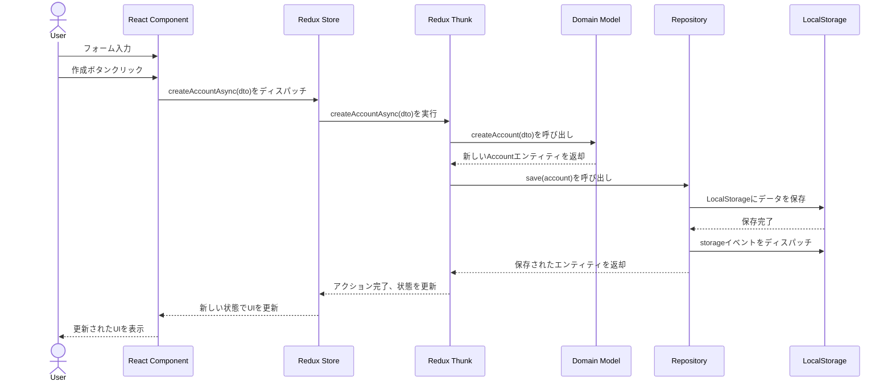
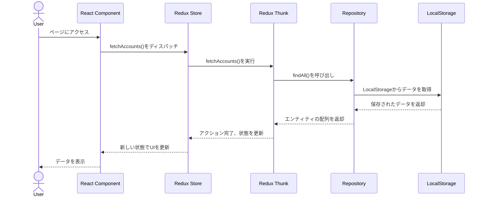
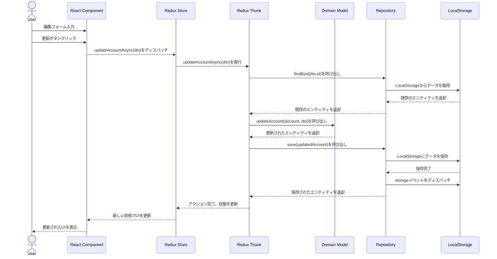
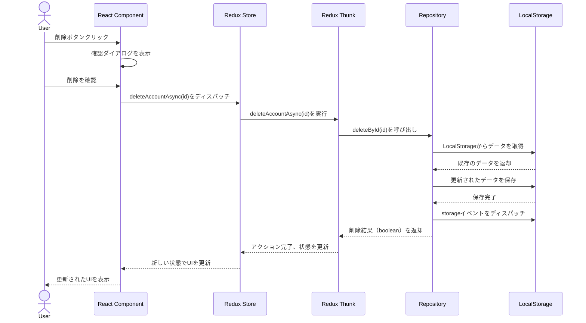

# CRMシステム シーケンス図

## データ作成フロー

以下のシーケンス図は、新しいエンティティ（例：取引先）を作成する際のデータフローを示しています。



## データ取得フロー

以下のシーケンス図は、アプリケーション起動時にデータを取得する際のフローを示しています。



## データ更新フロー

以下のシーケンス図は、既存のエンティティを更新する際のフローを示しています。



## データ削除フロー

以下のシーケンス図は、エンティティを削除する際のフローを示しています。



## タブ間同期フロー

以下のシーケンス図は、複数のタブ間でデータを同期する際のフローを示しています。

```mermaid
sequenceDiagram
    actor User1
    actor User2
    participant UI1 as Tab 1 UI
    participant Redux1 as Tab 1 Redux
    participant Storage as LocalStorage
    participant Redux2 as Tab 2 Redux
    participant UI2 as Tab 2 UI
    
    User1->>UI1: データを更新
    UI1->>Redux1: アクションをディスパッチ
    Redux1->>Storage: データを保存
    Storage->>Storage: storageイベントを発火
    Storage->>Redux2: storageイベントをリッスン
    Redux2->>Redux2: fetchAccounts()をディスパッチ
    Redux2->>Storage: データを再取得
    Storage-->>Redux2: 更新されたデータを返却
    Redux2-->>UI2: 新しい状態でUIを更新
    UI2-->>User2: 更新されたデータを表示
