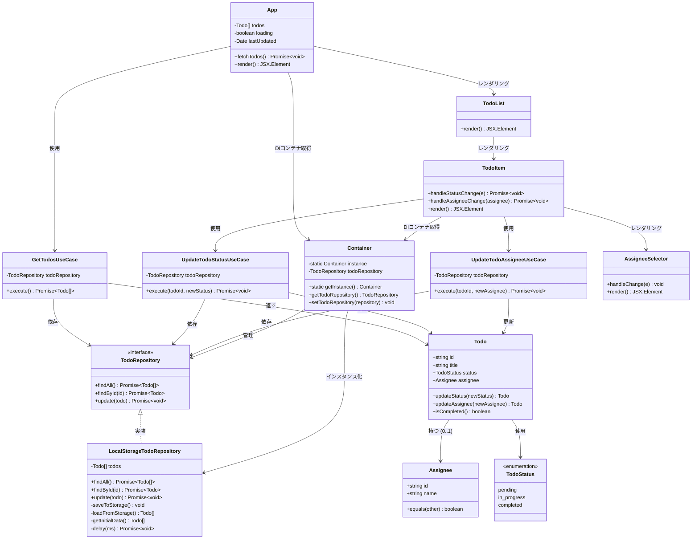
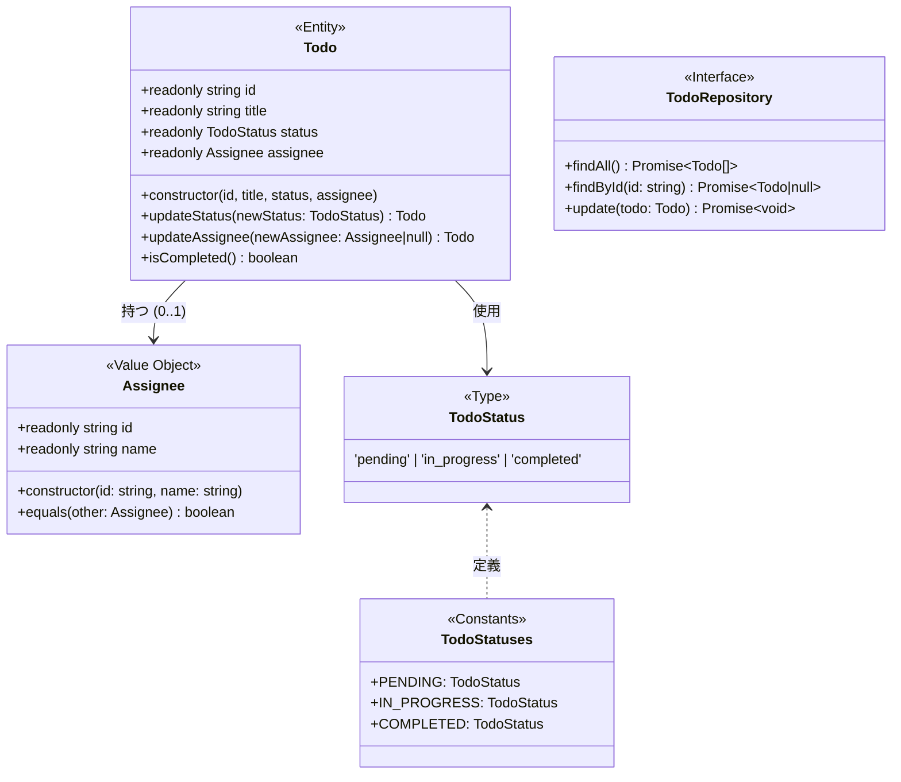
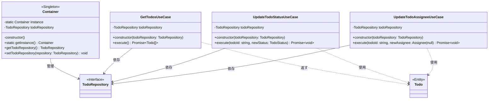
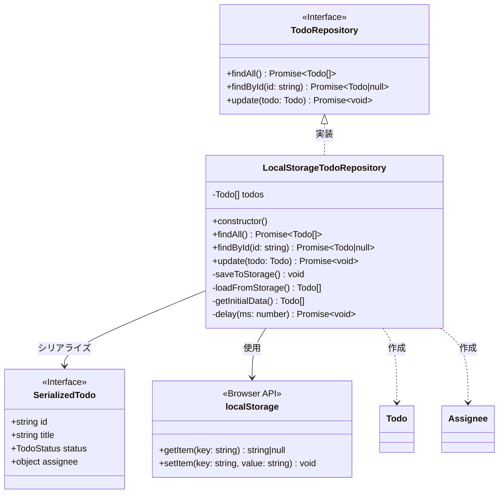
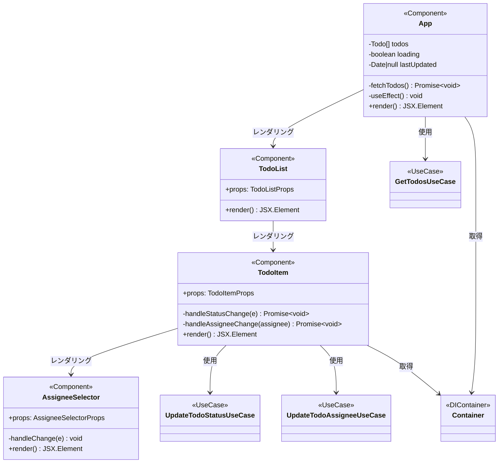
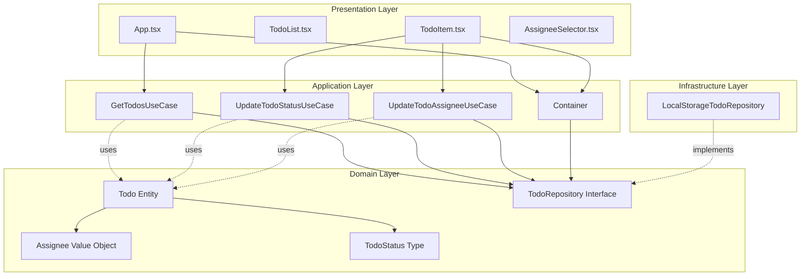
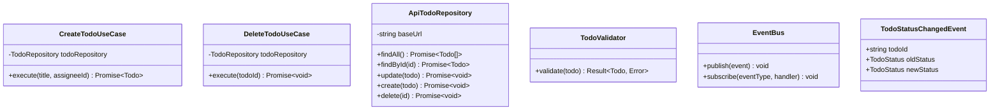

# クラス図

## 概要

このドキュメントでは、Todoアプリケーションの全体的なクラス構造を視覚化します。各レイヤーのクラスとその関係性を示します。

---

## 全体クラス図（レイヤー別）



---

## Domain層クラス図



### 説明

#### Todo（エンティティ）
- **不変性**: すべてのプロパティは`readonly`
- **更新**: 新しいインスタンスを返す（イミュータブル）
- **識別**: `id`で一意に識別
- **ビジネスロジック**: `isCompleted()`でビジネスルールをカプセル化

#### Assignee（バリューオブジェクト）
- **不変性**: `readonly`プロパティ
- **等価性**: `equals()`メソッドでID比較
- **依存関係**: Todoに所属

#### TodoStatus（型）
- Union型で状態を制限
- `TodoStatuses`定数で再利用可能な値を提供

#### TodoRepository（インターフェース）
- DIP（依存性逆転の原則）を実現
- Domain層がインターフェースを定義
- Infrastructure層が実装を提供

---

## Application層クラス図



### 説明

#### Use Cases
- **単一責任**: 各UseCaseは1つの責務のみ
- **依存性注入**: コンストラクタでリポジトリを受け取る
- **一貫性**: すべて`execute()`メソッドで処理を実行

#### Container（DIコンテナ）
- **Singletonパターン**: アプリケーション全体で1つのインスタンス
- **依存性管理**: リポジトリのライフサイクルを管理
- **柔軟性**: `setTodoRepository()`で実装を切り替え可能

---

## Infrastructure層クラス図



### 説明

#### LocalStorageTodoRepository
- **Repository実装**: `TodoRepository`インターフェースを実装
- **データ永続化**: LocalStorageにJSON形式で保存
- **複数タブ対応**: 毎回`loadFromStorage()`で最新データを取得
- **イミュータブル**: 新しい`Todo`インスタンスを返す

#### プライベートメソッド
- `saveToStorage()`: シリアライズしてLocalStorageに保存
- `loadFromStorage()`: LocalStorageから読み込みデシリアライズ
- `getInitialData()`: 初回起動時のサンプルデータ
- `delay()`: 非同期処理をシミュレート（50ms）

---

## Presentation層クラス図



### 説明

#### App（ルートコンポーネント）
- **状態管理**: `useState`でtodos、loading、lastUpdatedを管理
- **ポーリング**: `useEffect`で5秒ごとに`fetchTodos()`
- **Storage Event**: 他のタブの変更を検知して同期
- **UseCase呼び出し**: `GetTodosUseCase`を使用

#### TodoList（一覧表示）
- **Presentationalコンポーネント**: ロジックなし
- **Props**: `todos`と`onUpdate`
- **レンダリング**: `TodoItem`の配列を表示

#### TodoItem（個別アイテム）
- **イベントハンドラ**: 状態と担当者の変更を処理
- **UseCase呼び出し**: `UpdateTodoStatusUseCase`と`UpdateTodoAssigneeUseCase`
- **コールバック**: 更新後に`onUpdate()`を呼び出す

#### AssigneeSelector（担当者選択）
- **ドロップダウン**: 担当者一覧を表示
- **モックデータ**: コンポーネント内に3人の担当者
- **null許容**: 未割当もサポート

---

## レイヤー間の依存関係



### 依存性の方向

1. **Presentation → Application**: コンポーネントがUseCaseを呼び出す
2. **Application → Domain**: UseCaseがエンティティとリポジトリインターフェースを使用
3. **Infrastructure → Domain**: リポジトリ実装がインターフェースを実装
4. **逆依存なし**: 下位層は上位層に依存しない（DIP）

---

## オブジェクト図（実行時）

### Todo取得時のオブジェクト構造

```mermaid
graph LR
    subgraph "App Component Instance"
        AppState[todos: Todo[]]
    end

    subgraph "Container Instance (Singleton)"
        Repo[todoRepository: LocalStorageTodoRepository]
    end

    subgraph "GetTodosUseCase Instance"
        UseCase[todoRepository: TodoRepository]
    end

    subgraph "LocalStorageTodoRepository Instance"
        Storage[todos: Todo[]]
    end

    subgraph "Todo Instances"
        Todo1[Todo1: id=1, status=completed]
        Todo2[Todo2: id=2, status=in_progress]
        Todo3[Todo3: id=3, status=pending]
    end

    subgraph "Assignee Instances"
        Assignee1[Assignee: u1, 田中太郎]
        Assignee2[Assignee: u2, 佐藤花子]
    end

    Repo -.is.-> Storage
    UseCase --> Repo
    Storage --> Todo1
    Storage --> Todo2
    Storage --> Todo3
    Todo1 --> Assignee1
    Todo2 --> Assignee2
    AppState --> Todo1
    AppState --> Todo2
    AppState --> Todo3
```

---

## 設計パターン適用まとめ

| パターン | 適用箇所 | 目的 |
|---------|---------|------|
| **Entity** | `Todo` | ビジネスエンティティのカプセル化 |
| **Value Object** | `Assignee` | 不変な値オブジェクト |
| **Repository** | `TodoRepository` | データアクセスの抽象化 |
| **Use Case** | `Get/Update...UseCase` | アプリケーションロジックのカプセル化 |
| **Dependency Injection** | `Container` | 疎結合な設計 |
| **Singleton** | `Container` | グローバルなインスタンス管理 |
| **Immutability** | すべてのDomain | 不変性の保証 |
| **Container/Presentational** | Presentation層 | UIとロジックの分離 |

---

## クラスの責務と関係性マトリクス

| クラス | 作成 | 読取 | 更新 | 削除 | 管理 |
|-------|------|------|------|------|------|
| **Todo** | - | ✓ | ✓ | - | ビジネスルール |
| **Assignee** | - | ✓ | - | - | - |
| **TodoRepository** | - | ✓ | ✓ | - | 契約定義 |
| **LocalStorageTodoRepository** | ✓ | ✓ | ✓ | - | データ永続化 |
| **GetTodosUseCase** | - | ✓ | - | - | 取得ロジック |
| **UpdateTodoStatusUseCase** | - | ✓ | ✓ | - | 状態更新ロジック |
| **UpdateTodoAssigneeUseCase** | - | ✓ | ✓ | - | 担当者更新ロジック |
| **Container** | ✓ | ✓ | - | - | DI管理 |
| **App** | ✓ | ✓ | - | - | UI状態管理 |
| **TodoItem** | ✓ | ✓ | ✓ | - | UI更新処理 |

---

## 拡張ポイント

### 将来追加されるクラス



これらのクラスは現在の設計に簡単に追加でき、既存のコードを変更する必要はありません（オープン・クローズドの原則）。

---

## まとめ

このクラス図は以下を示しています:

1. **明確なレイヤー分離**: 各レイヤーが独立した責務を持つ
2. **依存性の方向**: 上位層から下位層への単方向依存
3. **インターフェース分離**: Domain層がインターフェースを定義、Infrastructure層が実装
4. **疎結合**: DIコンテナによる依存性注入
5. **拡張性**: 新しいクラスやUseCaseを追加しやすい設計

この設計により、テストが容易で、保守性が高く、拡張可能なアプリケーションを実現しています。
