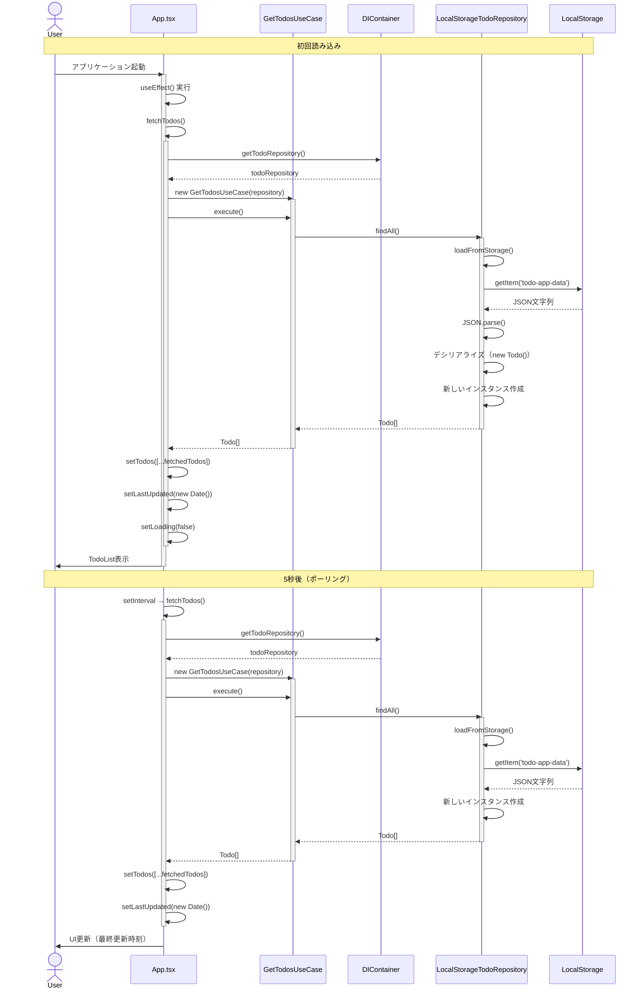
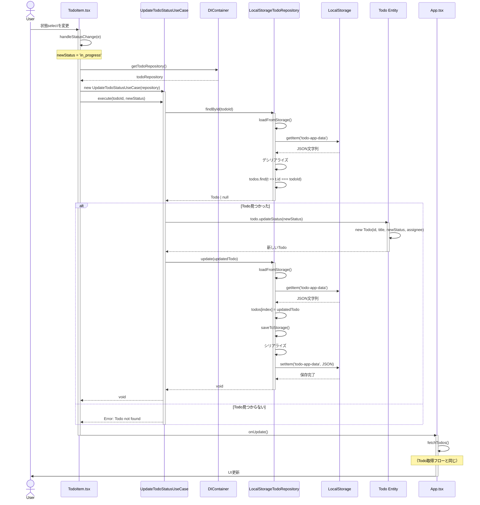
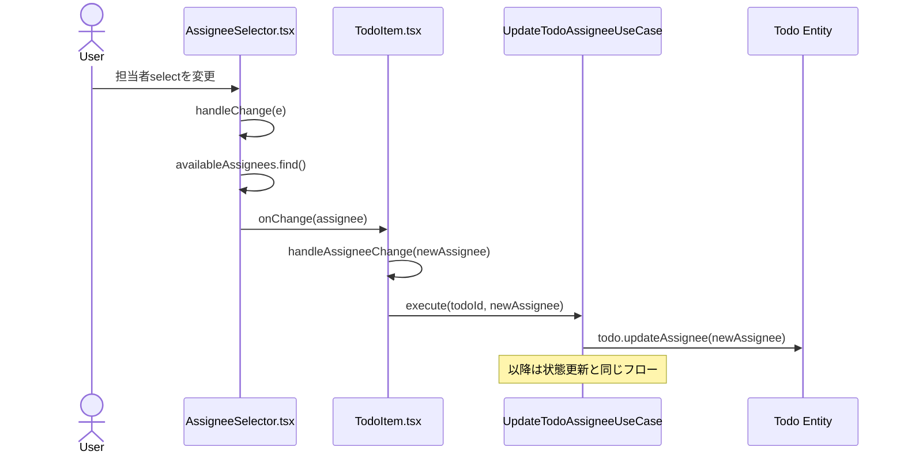
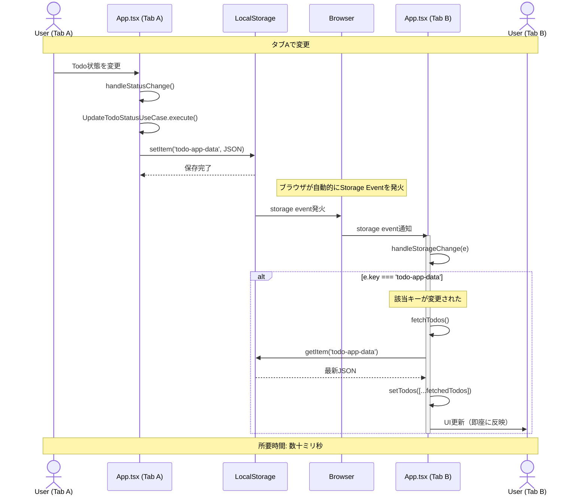
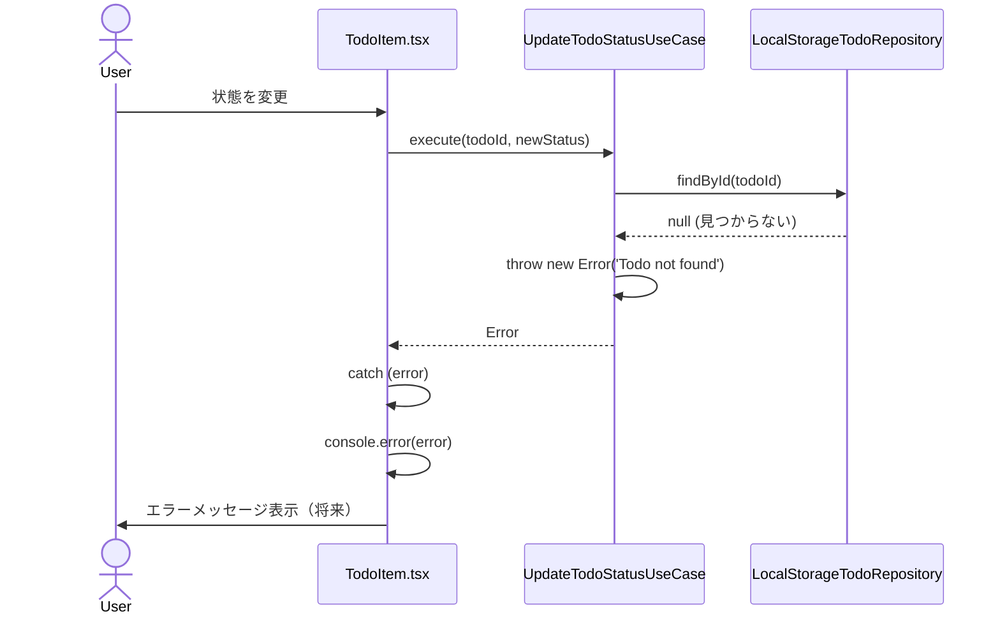
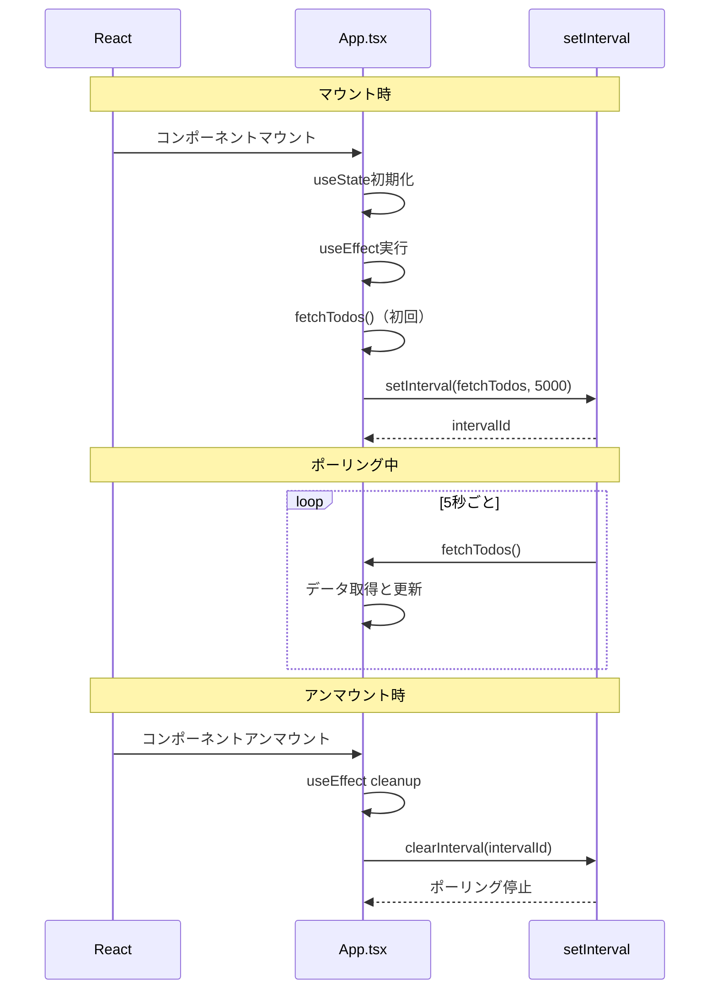
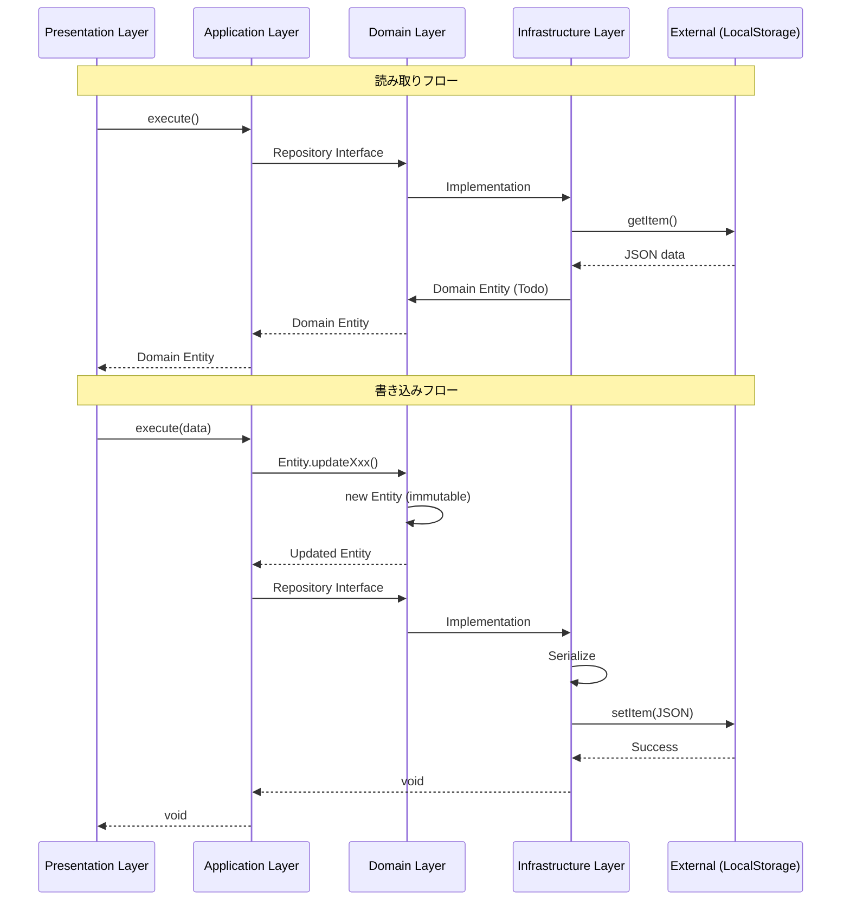

# シーケンス図

## 概要

このドキュメントでは、Todoアプリケーションの主要な処理フローをシーケンス図で視覚化します。

---

## 1. Todo取得フロー（初回読み込み + ポーリング）

### シナリオ
ユーザーがアプリケーションを開き、5秒ごとに自動でデータが更新される。

### シーケンス図



---

### 処理ステップ詳細

#### 初回読み込み

1. **アプリケーション起動**
   - Userがブラウザでアプリを開く
   - `App.tsx`コンポーネントがマウント

2. **useEffect実行**
   - マウント時に`useEffect`が実行される
   - `fetchTodos()`が呼ばれる

3. **DIコンテナからリポジトリ取得**
   - `container.getTodoRepository()`でリポジトリインスタンスを取得
   - Singleton パターンで同じインスタンスを返す

4. **UseCase作成と実行**
   - `GetTodosUseCase`を作成（コンストラクタでリポジトリ注入）
   - `execute()`メソッドを呼び出す

5. **リポジトリからデータ取得**
   - `LocalStorageTodoRepository.findAll()`が呼ばれる
   - `loadFromStorage()`でLocalStorageから読み込み
   - `localStorage.getItem('todo-app-data')`でJSON文字列取得

6. **デシリアライズ**
   - JSON文字列を`JSON.parse()`
   - 各要素を`new Todo()`で新しいインスタンスに変換
   - `Assignee`も`new Assignee()`で復元

7. **状態更新**
   - `setTodos([...fetchedTodos])`で新しい配列参照を作成
   - `setLastUpdated(new Date())`で最終更新時刻を記録
   - `setLoading(false)`でローディング状態を解除

8. **UIレンダリング**
   - `TodoList`コンポーネントがレンダリング
   - Userに一覧が表示される

#### ポーリング（5秒ごと）

9. **setIntervalによる定期実行**
   - 5秒（5000ms）ごとに`fetchTodos()`が自動実行
   - 手順3〜8と同じ処理を繰り返す

10. **UI更新**
    - データが変更されていれば、Reactが差分を検出して再レンダリング
    - 最終更新時刻が更新される

---

### 重要なポイント

#### 1. 毎回LocalStorageから読み込む理由

```typescript
async findAll(): Promise<Todo[]> {
  // 毎回最新のデータを読み込む（複数タブ同期のため）
  this.todos = this.loadFromStorage();
  // ...
}
```

**理由**:
- 他のタブでの変更を検知するため
- メモリキャッシュだけでは他タブの変更が反映されない
- 5秒ごとのポーリングで最新データを取得

#### 2. 新しいインスタンスを返す理由

```typescript
return this.todos.map(
  (todo) => new Todo(/* ... */)
);
```

**理由**:
- Reactは参照の変化で再レンダリングを判断
- 同じインスタンスを返すと変更を検知できない
- 毎回新しいインスタンスで確実に更新

#### 3. スプレッド演算子の使用

```typescript
setTodos([...fetchedTodos]);
```

**理由**:
- 配列の参照を変更してReactに変更を通知
- イミュータブルパターンに準拠

---

## 2. Todo更新フロー（状態変更）

### シナリオ
ユーザーがTodoの状態を「未着手」から「進行中」に変更する。

### シーケンス図



---

### 処理ステップ詳細

#### 更新フロー

1. **ユーザー操作**
   - Userが`<select>`で状態を変更
   - `onChange`イベントが発火

2. **イベントハンドラ実行**
   - `handleStatusChange(e)`が呼ばれる
   - `e.target.value`から新しい状態を取得（例: `'in_progress'`）

3. **DIコンテナからリポジトリ取得**
   - `container.getTodoRepository()`

4. **UseCase作成と実行**
   - `UpdateTodoStatusUseCase`を作成
   - `execute(todoId, newStatus)`を呼び出す

5. **既存Todoの取得**
   - `repository.findById(todoId)`で対象のTodoを検索
   - LocalStorageから最新データを読み込み
   - 該当するTodoを見つける

6. **条件分岐: Todoが見つかった場合**

   a. **Todoの更新**
   - `todo.updateStatus(newStatus)`を呼び出す
   - Todoエンティティ内で`new Todo()`を作成（イミュータブル）
   - 新しいTodoインスタンスを返す

   b. **リポジトリに保存**
   - `repository.update(updatedTodo)`
   - 更新前に最新データを再読み込み（他タブの変更を考慮）
   - `todos[index] = updatedTodo`で配列を更新

   c. **LocalStorageに永続化**
   - `saveToStorage()`でシリアライズ
   - `localStorage.setItem('todo-app-data', JSON.stringify(serialized))`

7. **条件分岐: Todoが見つからない場合**
   - `Error: Todo not found`をスロー
   - TodoItemでエラーハンドリング（現在はログ出力のみ）

8. **コールバック実行**
   - `onUpdate()`を呼び出してApp.tsxに通知
   - App.tsxで`fetchTodos()`が実行される

9. **UI更新**
   - 最新データを取得して状態を更新
   - Reactが差分検出して再レンダリング
   - Userに更新されたUIが表示される

---

### 担当者更新フローとの違い

担当者更新（`UpdateTodoAssigneeUseCase`）も基本的に同じフローですが、以下の点が異なります:



**主な違い**:
- `AssigneeSelector`が担当者リストから選択
- `null`の場合は「未割当」
- `todo.updateAssignee()`を使用

---

## 3. 複数タブ同期フロー（Storage Event）

### シナリオ
タブAで状態を変更し、タブBに即座に反映される。

### シーケンス図



---

### 処理ステップ詳細

1. **タブAでの変更**
   - UserAがTodoの状態を変更
   - `UpdateTodoStatusUseCase`が実行される
   - LocalStorageに保存

2. **Storage Event発火**
   - ブラウザが自動的に`storage`イベントを発火
   - **重要**: 変更を行ったタブ自身では発火しない
   - 同じオリジンの**他のタブ**のみで発火

3. **タブBでイベント受信**
   - `window.addEventListener('storage', handleStorageChange)`
   - `handleStorageChange`が呼ばれる

4. **キーの確認**
   ```typescript
   if (e.key === 'todo-app-data' || e.key === null)
   ```
   - `e.key === 'todo-app-data'`: 該当キーが変更された
   - `e.key === null`: `localStorage.clear()`が呼ばれた

5. **データ再取得**
   - `fetchTodos()`を実行
   - LocalStorageから最新データを読み込み

6. **UI更新**
   - `setTodos([...fetchedTodos])`で状態更新
   - Reactが差分検出して即座に再レンダリング

---

### ポーリングとの比較

| 方式 | タイミング | 遅延 | トリガー | 用途 |
|------|----------|------|---------|------|
| **Storage Event** | 変更時のみ | 数十ms | LocalStorage変更 | リアルタイム同期 |
| **ポーリング** | 5秒ごと | 最大5秒 | setInterval | フォールバック |

**両方を実装する理由**:
- Storage Eventで即座に同期（理想的）
- ポーリングでフォールバック（イベント失敗時や外部変更時）

---

## 4. エラーハンドリングフロー

### シナリオ
存在しないTodoIDで更新を試みた場合。

### シーケンス図



### 現在のエラーハンドリング

```typescript
try {
  await updateStatusUseCase.execute(todo.id, newStatus);
  onUpdate();
} catch (error) {
  console.error('[TodoItem] エラー:', error);
  // 将来: ユーザーにエラーを表示
}
```

### 将来の改善

1. **トースト通知**
   ```typescript
   toast.error('Todoの更新に失敗しました');
   ```

2. **エラー状態の管理**
   ```typescript
   const [error, setError] = useState<string | null>(null);
   if (error) return <ErrorMessage message={error} />;
   ```

3. **リトライ機能**
   ```typescript
   const retry = async () => {
     setError(null);
     await updateStatusUseCase.execute(todo.id, newStatus);
   };
   ```

---

## 5. コンポーネントライフサイクルフロー

### マウント → ポーリング → アンマウント



### Cleanup処理の重要性

```typescript
useEffect(() => {
  fetchTodos();
  const intervalId = setInterval(fetchTodos, 5000);

  // Cleanup関数
  return () => clearInterval(intervalId);
}, [fetchTodos]);
```

**理由**:
- メモリリーク防止
- 不要なAPI呼び出しを停止
- パフォーマンス向上

---

## 6. データフロー全体像

### レイヤー間のデータの流れ



---

## まとめ

### 主要フローの特徴

1. **Todo取得フロー**
   - ポーリングで定期的にデータ更新
   - 毎回LocalStorageから読み込み
   - 新しいインスタンスで確実に再レンダリング

2. **Todo更新フロー**
   - UseCaseでビジネスロジックをカプセル化
   - エンティティでイミュータブルな更新
   - コールバックでUI同期

3. **複数タブ同期**
   - Storage Eventで即座に同期
   - ポーリングでフォールバック
   - 二重の仕組みで確実な同期

4. **エラーハンドリング**
   - UseCaseレベルでエラーをスロー
   - Presentation層でキャッチして処理
   - 将来的にユーザーに通知

これらのフローにより、リアルタイム性と信頼性を兼ね備えた、保守性の高いアプリケーションを実現しています。
